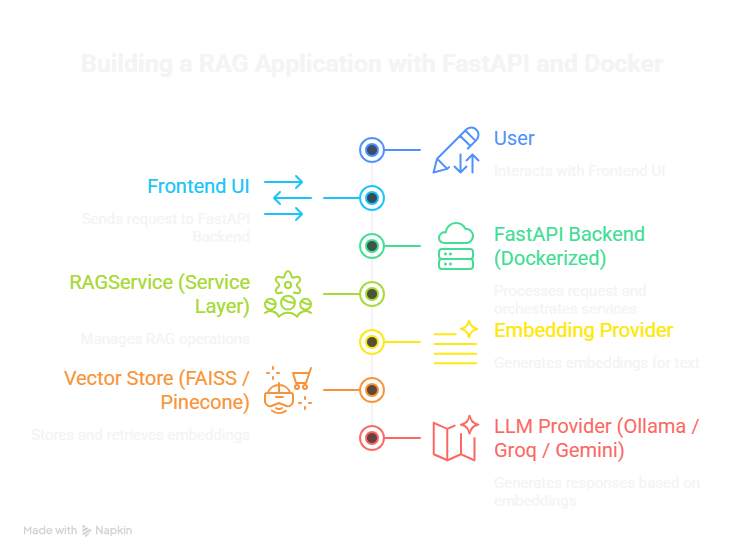
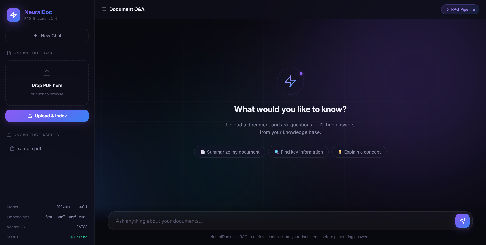
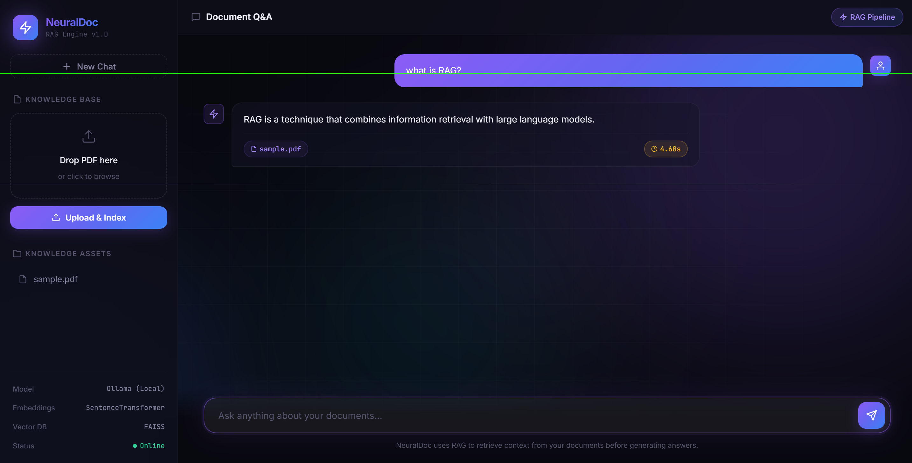
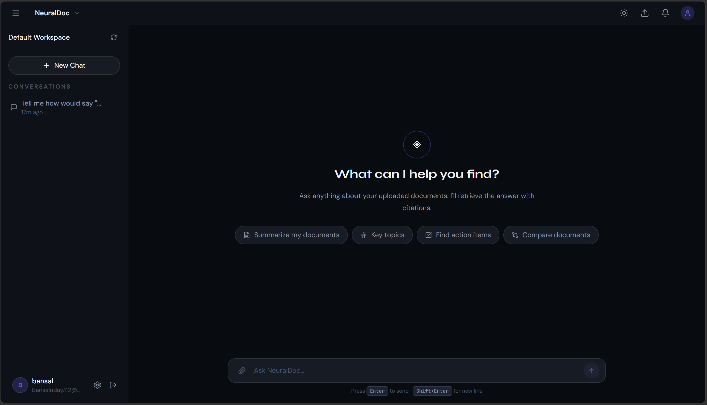
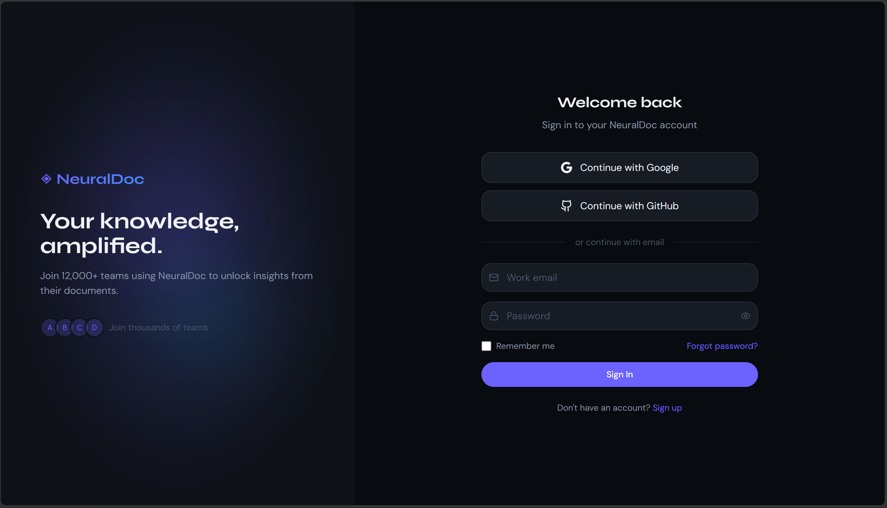

# NeuralDoc AI — Production-Ready RAG SaaS Platform

> 🚀 Enterprise-grade Retrieval-Augmented Generation (RAG) system with async workers, multi-tenant isolation, and vector-based semantic search.

[](https://python.org)
[](https://fastapi.tiangolo.com)
[](https://react.dev)
[](https://docker.com)
[](https://redis.io)
[](https://pinecone.io)
[](#-license)
[](https://rag-assistant-2-rqep.onrender.com)

---

## 📋 Quick Navigation

- [Overview](#-overview)
- [Core Features](#-core-features)
- [Architecture](#-system-architecture)
- [Tech Stack](#-tech-stack)
- [Installation](#-installation)
- [Configuration](#-configuration)
- [Quick Start](#-quick-start)
- [API Documentation](#-api-documentation)
- [Document Lifecycle](#-document-lifecycle)
- [Security](#-security)
- [Troubleshooting](#-troubleshooting)
- [Contributing](#-contributing)
- [Roadmap](#-roadmap)
- [License](#-license)

---

## 📌 Overview

NeuralDoc AI is a production-oriented Retrieval-Augmented Generation (RAG) platform that enables users to upload documents and interact with them using Large Language Models (LLMs). Unlike experimental RAG prototypes, NeuralDoc is built with enterprise engineering patterns for scalability, reliability, and multi-tenant isolation.

**Why NeuralDoc?** Modern AI document systems require more than semantic search—they demand fault-tolerant async pipelines, user-scoped data isolation, comprehensive monitoring, and containerized infrastructure.

### Key Differentiators

- ✅ **Multi-tenant SaaS architecture** with JWT-based tenant isolation
- ✅ **Fault-tolerant async pipelines** using Redis + Celery workers
- ✅ **Production-grade observability** with structured logging and health monitoring
- ✅ **Scalable vector retrieval** via Pinecone (cloud) or FAISS (local)
- ✅ **Fully Dockerized** for reproducible deployments
- ✅ **Real-time processing status** tracking for better UX

### Live Demo
🔗 **Try it now:** [https://rag-assistant-2-rqep.onrender.com](https://rag-assistant-2-rqep.onrender.com)

---

## ✨ Core Features

### 🔐 Multi-User SaaS Architecture
- JWT-based authentication with secure token refresh
- Tenant-isolated document storage and retrieval
- User-specific chat sessions and history
- Role-based access control (RBAC) ready
- Password hashing with bcrypt

### 📄 AI-Powered Document Intelligence
- PDF parsing with automatic text extraction
- Semantic chunking with configurable chunk size
- Multi-model embedding support (local, Hugging Face, Pinecone)
- Context-aware LLM responses with citation support
- Configurable embedding dimensions (1536, 1024, etc.)

### ⚡ Async Processing Infrastructure
- Redis-backed task queue for reliable job distribution
- Celery workers for scalable background processing
- Non-blocking file uploads with progress tracking
- Automatic retry logic with exponential backoff
- Dead-letter queue support for failed tasks

### ☁️ Vector Search & Retrieval
- Pinecone cloud integration for production deployments
- FAISS local indexing for development environments
- User-scoped vector retrieval with namespace filtering
- Hybrid search capabilities (keyword + semantic)
- Configurable similarity thresholds

### 🐳 Production Infrastructure
- Docker Compose orchestration for local + cloud deployments
- Health check endpoints for monitoring
- Structured JSON logging for observability
- Environment-based configuration management
- CI/CD ready with GitHub Actions support

---

## 🏗️ System Architecture

### High-Level System Diagram



```
┌─────────────────┐
│  Frontend       │
│  (React/Vite)   │
└────────┬────────┘
         │ HTTP/WebSocket
┌────────▼────────────────────┐
│  FastAPI Backend            │
│  • Auth Layer               │
│  • API Routes               │
│  • Request Validation       │
└────────┬────────────────────┘
         │
    ┌────┴─────────┬──────────────┐
    │              │              │
    ▼              ▼              ▼
┌────────┐  ┌──────────┐  ┌────────────┐
│ Redis  │  │ Supabase │  │ Pinecone   │
│ Queue  │  │ Auth/DB  │  │ Vector DB  │
└────┬───┘  └──────────┘  └────────────┘
     │
     ▼
┌──────────────────────┐
│ Celery Workers       │
│ • PDF Extraction     │
│ • Chunking           │
│ • Embeddings         │
│ • Vector Upsert      │
└──────────────────────┘
```

### Document Ingestion Pipeline



```
1. Upload PDF
   ↓
2. Store in Supabase (S3-compatible)
   ↓
3. Enqueue task → Redis
   ↓
4. Celery Worker picks up task
   ├─→ Extract text from PDF
   ├─→ Semantic chunking (overlap handling)
   ├─→ Generate embeddings (batch processing)
   └─→ Upsert vectors to Pinecone (with metadata)
   ↓
5. Update document status: queued → processing → completed
   ↓
6. Frontend receives status updates via polling
```

### Query & RAG Flow



```
1. User asks question in chat
   ↓
2. Generate query embedding
   ↓
3. Search Pinecone (user-scoped namespace)
   ↓
4. Retrieve top-k similar chunks
   ↓
5. Build context window with citations
   ↓
6. Send to LLM with system prompt
   ↓
7. Stream response to frontend
```

### Database Schema

**Documents Table (Supabase)**
```sql
id            UUID PRIMARY KEY
user_id       UUID (Foreign Key → users)
file_name     TEXT
storage_path  TEXT
file_hash     TEXT (for deduplication)
status        ENUM (queued, processing, completed, failed)
progress      INT (0-100)
error_msg     TEXT (nullable)
created_at    TIMESTAMP
updated_at    TIMESTAMP
```

**Chat Sessions Table**
```sql
id            UUID PRIMARY KEY
user_id       UUID (Foreign Key → users)
document_id   UUID (Foreign Key → documents)
title         TEXT
messages      JSONB
created_at    TIMESTAMP
updated_at    TIMESTAMP
```

---

## 📊 Application Screenshots

### Dashboard

Central hub showing document statistics, recent activity, and quick actions.

### Knowledge Base

Organized document library with search, filtering, and status monitoring.

### Chat Workspace

Interactive RAG chat interface with context awareness and citation support.

### Authentication

Secure JWT-based login/signup flow with password validation.

### Processing Status

Real-time indexing progress with stage-by-stage tracking (extraction → chunking → embedding → storage).

---

## 🧩 Tech Stack

### Frontend
| Tech | Version | Purpose |
|------|---------|---------|
| React | 18+ | UI framework |
| TypeScript | 5+ | Type safety |
| Vite | 5+ | Build tool |
| TailwindCSS | 3+ | Styling |
| Axios/Fetch | Latest | HTTP client |

### Backend
| Tech | Version | Purpose |
|------|---------|---------|
| FastAPI | 0.100+ | Web framework |
| Python | 3.11+ | Runtime |
| Pydantic | 2+ | Data validation |
| Supabase | Latest | Auth + DB |
| Celery | 5.3+ | Task queue |
| Redis | 7+ | Message broker |

### AI / ML Stack
| Tech | Provider | Use Case |
|------|----------|----------|
| Sentence Transformers | Hugging Face | Embeddings (local) |
| Pinecone | Pinecone.io | Vector DB (production) |
| FAISS | Meta | Vector DB (local) |
| Groq | Groq API | Fast LLM inference |
| Gemini | Google | Alternative LLM |
| Ollama | Local | Self-hosted LLM |

### DevOps & Infrastructure
| Component | Purpose |
|-----------|---------|
| Docker | Containerization |
| Docker Compose | Service orchestration |
| GitHub Actions | CI/CD (optional) |
| MLflow | Experiment tracking |
| Structured Logging | JSON logs for ELK |
| Health Endpoints | Kubernetes-ready probes |

---

## 📂 Project Structure

```
NeuralDoc/
├── frontend/                    # React + Vite SPA
│   ├── src/
│   │   ├── pages/              # Route pages (Dashboard, Chat, KnowledgeBase)
│   │   ├── components/         # Reusable React components
│   │   ├── hooks/              # Custom hooks (use-auth, use-document-polling)
│   │   ├── lib/                # Utilities (API client, auth helpers)
│   │   ├── providers/          # Context providers (AuthProvider)
│   │   └── services/           # API service layer
│   ├── public/                 # Static assets
│   ├── package.json
│   ├── tsconfig.json
│   ├── vite.config.ts
│   └── Dockerfile
│
├── backend/                     # FastAPI + Celery
│   ├── app/
│   │   ├── main.py             # FastAPI app entry
│   │   ├── routes/             # API route handlers
│   │   │   ├── auth.py         # Authentication endpoints
│   │   │   ├── chat.py         # Chat endpoints
│   │   │   ├── documents.py    # Document CRUD
│   │   │   └── health.py       # Health checks
│   │   ├── services/           # Business logic
│   │   │   ├── auth_service.py
│   │   │   ├── document_service.py
│   │   │   ├── llm.py
│   │   │   └── rag/            # RAG orchestration
│   │   ├── workers/            # Celery workers
│   │   │   ├── celery_app.py   # Celery config
│   │   │   ├── indexing_tasks.py  # PDF indexing task
│   │   │   └── indexing_worker.py # Worker entry
│   │   ├── core/               # Core utilities
│   │   │   ├── config.py       # Configuration
│   │   │   ├── database.py     # DB connection
│   │   │   ├── logger.py       # Structured logging
│   │   │   ├── queue.py        # Queue utilities
│   │   │   ├── security.py     # JWT, hashing
│   │   │   └── supabase_client.py
│   │   ├── schemas/            # Pydantic models
│   │   ├── models/             # Data models
│   │   └── utils/              # Helper functions
│   ├── scripts/                # Utility scripts
│   │   ├── seed_data.py
│   │   ├── reindex.py
│   │   └── create_chat_tables.sql
│   ├── logs/                   # Application logs
│   ├── requirements.txt        # Python dependencies
│   ├── requirements-prod.txt   # Production dependencies
│   ├── Dockerfile
│   └── worker.py               # Celery worker entry
│
├── docs/
│   ├── architecture/           # Architecture diagrams
│   │   ├── architecturaldiagram.png
│   │   ├── Load.png
│   │   └── ask.png
│   └── screenshots/            # UI screenshots
│
├── docker-compose.yml          # Multi-service orchestration
├── .env                        # Environment variables
├── .env.example                # Environment template
├── .gitignore
└── README.md                   # This file
```

---

## 🔄 Document Lifecycle

NeuralDoc tracks documents through distinct processing states for observability and UX transparency:

| State | Description | Frontend Display |
|-------|-------------|------------------|
| **queued** | Task enqueued, awaiting worker pickup | ⏳ Pending |
| **processing** | Active indexing (extraction → embedding → storage) | 🔄 Processing (with progress %) |
| **completed** | Successfully indexed and searchable | ✅ Ready |
| **failed** | Processing error (see error message) | ❌ Failed (with retry option) |

**State Transitions:**
```
queued → processing → completed
            ↓
            failed → (manual retry or re-upload)
```

### Real-Time Progress Tracking

The progress field (0-100) maps to pipeline stages:
- `10%` - File extraction started
- `30%` - Text extraction complete
- `50%` - Chunking complete
- `80%` - Embedding generation complete
- `100%` - Vectors stored in Pinecone

---

## 🔐 Security

### Authentication & Authorization
- **JWT tokens** for stateless authentication
- **Refresh token rotation** to mitigate token theft
- **CORS** configuration for frontend integration
- **HTTPS-only** in production (enforce via nginx)
- **Password hashing** using bcrypt with salt rounds ≥ 12

### Data Isolation
- **User-scoped queries** on all document/chat endpoints
- **Namespace filtering** in Pinecone (vectors tagged by user_id)
- **Row-level security (RLS)** in Supabase
- **File path obfuscation** (UUIDs instead of sequential IDs)

### API Security
- **Rate limiting** on auth endpoints (5 requests/minute)
- **Input validation** via Pydantic schemas
- **SQL injection prevention** via parameterized queries
- **XSS prevention** via Content-Security-Policy headers

### Infrastructure Security
- **Environment secrets** managed via `.env` (never committed)
- **Docker network** isolation (backend ↔ Redis, no external access)
- **Least-privilege** Celery task permissions
- **Health endpoints** protected with optional API keys

---

## 🚀 Installation

### Prerequisites

Ensure you have installed:
- **Git** 2.30+
- **Python** 3.11+
- **Node.js** 18+ with npm 9+
- **Docker** 24+ and **Docker Compose** 2.20+
- **Redis** 7+ (or Docker image)

### Clone Repository

```bash
git clone https://github.com/yourusername/neuraldoc.git
cd neuraldoc
cp .env.example .env
```

### Backend Setup

```bash
cd backend

# Create virtual environment
python -m venv .venv

# Activate virtual environment
# On Windows:
.venv\Scripts\activate
# On macOS/Linux:
source .venv/bin/activate

# Install dependencies
pip install -r requirements.txt

# Optional: Install production dependencies
# pip install -r requirements-prod.txt
```

### Frontend Setup

```bash
cd frontend

# Install dependencies
npm install

# Optional: Generate TypeScript types from API
# npm run generate-types
```

---

## ⚙️ Configuration

### Environment Variables

Create `.env` file in project root:

```bash
# Frontend (optional)
VITE_API_BASE_URL=http://localhost:8000

# Backend - LLM Configuration
LLM_PROVIDER=groq  # Options: groq, gemini, ollama
GROQ_API_KEY=gsk_...
GEMINI_API_KEY=AIza...
EMBEDDING_PROVIDER=local  # Options: local, huggingface, openai

# Backend - Vector Database
VECTOR_DB_PROVIDER=pinecone  # Options: pinecone, faiss
PINECONE_API_KEY=pcsk_...
PINECONE_INDEX=neuraldoc-index

# Backend - Authentication
SUPABASE_URL=https://xxx.supabase.co
SUPABASE_ANON_KEY=eyJh...
SUPABASE_SERVICE_KEY=eyJh...

# Backend - Task Queue
REDIS_HOST=localhost
REDIS_PORT=6379
CELERY_BROKER_URL=redis://localhost:6379/0
CELERY_RESULT_BACKEND=redis://localhost:6379/0

# Backend - File Upload
UPLOAD_DIR=/app/tmp_uploads
MAX_FILE_SIZE_MB=50
DOCUMENT_STORAGE_BUCKET=documents

# Logging
LOG_LEVEL=info
```

### Supabase Setup

1. Create Supabase project at https://supabase.com
2. Create tables using SQL scripts in `backend/scripts/create_chat_tables.sql`
3. Set up storage bucket named `documents`
4. Enable RLS policies for user isolation
5. Copy keys to `.env`

### Pinecone Setup

1. Create Pinecone index at https://pinecone.io
2. Dimension: 1536 (for Sentence Transformers)
3. Metric: cosine
4. Add metadata indexing for `user_id`
5. Copy API key to `.env`

---

## 🚀 Quick Start

### Using Docker Compose (Recommended)

```bash
# From project root
docker compose up --build

# Services:
# Frontend:  http://localhost:3000
# Backend:   http://localhost:8000
# Redis:     localhost:6379
# Celery:    Listening on Redis queue
```

### Local Development

#### Terminal 1: Start Backend

```bash
cd backend
.venv\Scripts\activate  # or: source .venv/bin/activate
uvicorn app.main:app --reload --host 0.0.0.0 --port 8000
```

#### Terminal 2: Start Celery Worker

```bash
cd backend
.venv\Scripts\activate
python -m celery -A app.workers.celery_app:celery_app worker --loglevel=info --pool=solo
```

#### Terminal 3: Start Redis

```bash
docker run -d -p 6379:6379 redis:7-alpine
```

#### Terminal 4: Start Frontend

```bash
cd frontend
npm run dev
# Open http://localhost:5173
```

### Health Checks

```bash
# Backend health
curl http://localhost:8000/health

# Celery worker status
python -m celery -A app.workers.celery_app:celery_app inspect active
```

---

## 📚 API Documentation

### Swagger UI
Auto-generated API docs available at: `http://localhost:8000/docs`

### Key Endpoints

#### Authentication
- `POST /api/auth/signup` - Register new user
- `POST /api/auth/login` - Login and get tokens
- `POST /api/auth/refresh` - Refresh access token
- `POST /api/auth/logout` - Logout user

#### Documents
- `GET /api/documents` - List user documents
- `POST /api/documents/upload` - Upload PDF
- `GET /api/documents/{id}` - Get document metadata
- `DELETE /api/documents/{id}` - Delete document

#### Chat
- `GET /api/chat/sessions` - List chat sessions
- `POST /api/chat/sessions` - Create session
- `POST /api/chat/sessions/{id}/messages` - Send message
- `GET /api/chat/sessions/{id}/messages` - Get conversation history

#### Health
- `GET /health` - Service health status
- `GET /health/redis` - Redis connectivity
- `GET /health/supabase` - Supabase connectivity

---

## 🔧 Troubleshooting

### Common Issues

#### **Celery: "Received unregistered task"**
**Solution:** Ensure `app.workers.indexing_tasks` is imported in `celery_app.py` config:
```python
celery_app.conf.update(
    imports=("app.workers.indexing_tasks",),
    task_track_started=True,
)
```

#### **Redis Connection Refused**
```bash
# Check Redis is running
redis-cli ping

# If not, start Redis:
docker run -d -p 6379:6379 redis:7-alpine
```

#### **Pinecone API Errors**
- Verify `PINECONE_API_KEY` is valid
- Check index name matches `PINECONE_INDEX` in `.env`
- Confirm index dimension (1536) matches embedding model

#### **Frontend CORS Errors**
Add to `backend/app/main.py`:
```python
from fastapi.middleware.cors import CORSMiddleware

app.add_middleware(
    CORSMiddleware,
    allow_origins=["http://localhost:5173"],
    allow_credentials=True,
    allow_methods=["*"],
    allow_headers=["*"],
)
```

#### **Tasks Stuck in Queue**
```bash
# Purge all tasks (WARNING: destructive)
celery -A app.workers.celery_app purge

# Check active tasks
celery -A app.workers.celery_app inspect active

# Terminate stuck worker
celery -A app.workers.celery_app control shutdown
```

---

## 🤝 Contributing

We welcome contributions! Please follow these steps:

1. **Fork** the repository
2. **Create** a feature branch: `git checkout -b feature/my-feature`
3. **Commit** changes: `git commit -m "feat: add my feature"`
4. **Push** to branch: `git push origin feature/my-feature`
5. **Open** a Pull Request

### Code Style
- **Python:** Black formatter, isort for imports
- **TypeScript:** Prettier, ESLint
- **Commit messages:** Conventional Commits (feat:, fix:, docs:, etc.)

### Testing
```bash
# Backend tests
pytest backend/tests

# Frontend tests
npm run test
```

---

## 📈 Roadmap

### Phase 1: Infrastructure Stabilization (Q2 2026)
- [ ] Queue monitoring dashboard (Redis insights)
- [ ] Dead-letter queue for failed tasks
- [ ] Worker concurrency tuning and auto-scaling
- [ ] Upload validation and file size limits
- [ ] Stale task recovery and cleanup

### Phase 2: Advanced Retrieval (Q3 2026)
- [ ] Hybrid RAG (keyword + semantic search)
- [ ] Multi-hop query decomposition
- [ ] Re-ranking with cross-encoders
- [ ] Citation generation with source tracking
- [ ] GraphRAG for structured document understanding

### Phase 3: Enterprise Features (Q4 2026)
- [ ] SAML/SSO integration
- [ ] Team workspaces and collaboration
- [ ] Audit logging and compliance tracking
- [ ] Custom embedding fine-tuning
- [ ] Usage analytics and cost breakdown

---

## 📄 License

This project is licensed under the **MIT License** — see the [LICENSE](LICENSE) file for details.

Commercial use is permitted with attribution.

---

## 👨‍💻 Author

**Uday Bansal**

B.Tech Computer Science (AIML Specialization)

**Expertise:**
- AI Infrastructure Engineering
- Distributed Systems & Backend Architecture
- Production RAG Systems
- SaaS Platform Engineering

**Contact & Links:**
- GitHub: [@udaybansal](https://github.com/udaybansal)
- LinkedIn: [Uday Bansal](https://linkedin.com/in/udaybansal)
- Email: uday@neuraldoc.ai

---

## 📞 Support

### Getting Help

- **Docs:** Check [Architecture Guide](docs/architecture/README.md)
- **Issues:** [GitHub Issues](https://github.com/udaybansal/neuraldoc/issues)
- **Discussions:** [GitHub Discussions](https://github.com/udaybansal/neuraldoc/discussions)
- **Email:** support@neuraldoc.ai

### Report a Bug

Found a bug? Open an issue with:
1. **Steps to reproduce**
2. **Expected vs. actual behavior**
3. **Environment** (OS, Python version, etc.)
4. **Error logs** (use `-vv` flag for verbose output)

---

## 🙏 Acknowledgments

- [Pinecone](https://pinecone.io) for vector database infrastructure
- [Supabase](https://supabase.com) for PostgreSQL hosting
- [FastAPI](https://fastapi.tiangolo.com) community
- [Celery](https://docs.celeryproject.io) for task queue
- All open-source contributors

---

## 📌 Final Note

NeuralDoc AI is a production-ready platform designed to bridge the gap between RAG research prototypes and deployable enterprise systems. It demonstrates how modern AI backends evolve from experimental ideas into scalable, observable, multi-tenant platforms.

Whether you're building internal RAG systems or shipping to production users, NeuralDoc provides battle-tested patterns for:

✨ Distributed task processing
✨ Fault-tolerant pipelines
✨ Multi-tenant data isolation
✨ Real-time status tracking
✨ Enterprise observability

**Happy building!** 🚀
