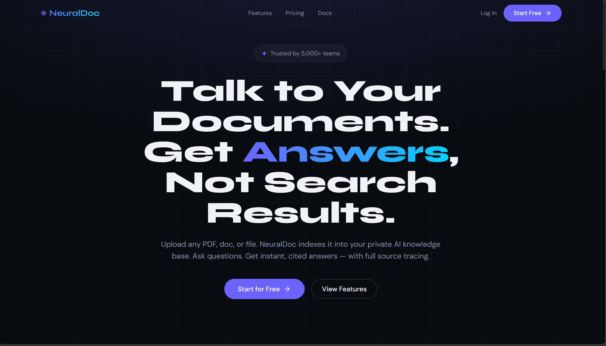
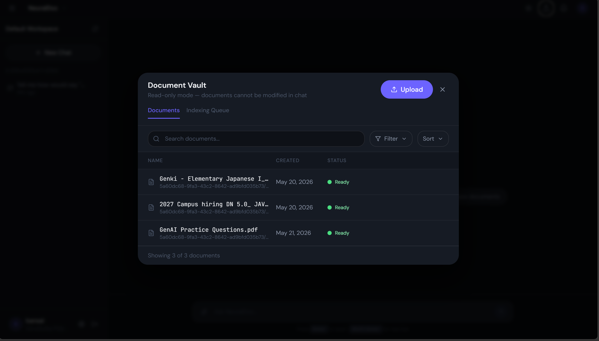

# NeuralDoc AI — Production-Ready RAG SaaS Platform

> 🚀 Enterprise-grade Retrieval-Augmented Generation (RAG) system with async workers, multi-tenant isolation, and vector-based semantic search.

[](https://python.org)
[](https://fastapi.tiangolo.com)
[](https://react.dev)
[](https://www.typescriptlang.org)
[](https://docker.com)
[](https://redis.io)
[](https://pinecone.io)
[](https://mlflow.org)
[](#-license)
[](https://rag-assistant-2-rqep.onrender.com)

---

## 📋 Quick Navigation

- [Overview](#-overview)
- [Core Features](#-core-features)
- [Architecture](#-system-architecture)
- [Tech Stack](#-tech-stack)
- [Project Structure](#-project-structure)
- [Installation](#-installation)
- [Configuration](#-configuration)
- [Quick Start](#-quick-start)
- [API Documentation](#-api-documentation)
- [Document Lifecycle](#-document-lifecycle)
- [Security](#-security)
- [Troubleshooting](#-troubleshooting)
- [Roadmap](#-roadmap)
- [Contributing](#-contributing)
- [License](#-license)

---

## 📌 Overview

**NeuralDoc AI** is a production-oriented Retrieval-Augmented Generation (RAG) platform that enables users to upload PDF documents and interact with them using Large Language Models (LLMs). The system features a marketing Landing Page, secure JWT Authentication, a Dashboard for document management, a Document Vault for indexing, and a Chat Workspace with real-time session management, source citations, and latency tracking.

Unlike experimental RAG prototypes, NeuralDoc is engineered with enterprise-grade patterns for scalability, reliability, and multi-tenant data isolation.

**Why NeuralDoc?** Modern AI document systems need more than semantic search — they demand fault-tolerant async pipelines, user-scoped data isolation, comprehensive observability, and containerized infrastructure.

### Key Differentiators

- ✅ **Multi-tenant SaaS architecture** with JWT-based tenant isolation
- ✅ **Fault-tolerant async pipelines** using Redis + Celery workers with 3-retry exponential backoff
- ✅ **Production-grade observability** with structured JSON logging (context-var scoped per request/task)
- ✅ **Scalable vector retrieval** via Pinecone (cloud) or FAISS (local)
- ✅ **Model warm-up on startup** — embedding model loaded in background thread at boot
- ✅ **Rate limiting** via SlowAPI + configurable per-route limits
- ✅ **Fully Dockerized** for reproducible deployments
- ✅ **MLflow** for experiment and run tracking

### Live Demo
🔗 **Try it now:** [https://rag-assistant-2-rqep.onrender.com](https://rag-assistant-2-rqep.onrender.com)

---

## ✨ Core Features

### 🔐 Multi-User SaaS Architecture
- JWT-based authentication via Supabase (anon + service keys)
- Tenant-isolated document storage and vector retrieval
- User-specific chat sessions and history
- Password hashing with `passlib[bcrypt]`
- Row-level security (RLS) in Supabase PostgreSQL

### 📄 AI-Powered Document Intelligence
- PDF parsing via `pypdf` with automatic text extraction
- Semantic chunking with configurable chunk size and overlap
- Multi-model embedding support: **local** (`sentence-transformers`) and **Gemini** (`google-genai`)
- Context-aware LLM responses with source citation
- Configurable embedding dimensions (768 / 1536+)

### ⚡ Async Processing Infrastructure
- Redis-backed Celery task queue for reliable job distribution
- `process_document` Celery task with `bind=True, max_retries=3`
- Automatic retry with 10-second countdown between attempts
- Stage callbacks for real-time progress updates (10% → 30% → 50% → 80% → 100%)
- Temp-file cleanup on task completion (success or failure)
- Dead-letter queue support for failed tasks

### ☁️ Vector Search & Retrieval
- **Pinecone** cloud integration for production deployments (user-scoped namespaces)
- **FAISS** local indexing for development (`faiss-cpu`)
- User-scoped vector retrieval with namespace filtering
- Configurable similarity thresholds and top-k retrieval

### 🔍 Observability & Monitoring
- **Structured JSON logging** using Python `logging` + `contextvars` (request_id, user_id, task_id, latency_ms)
- **MLflow** experiment tracking with local SQLite backend (`mlflow.db`)
- **Health check endpoints** for backend, Redis, and Supabase
- **SlowAPI** rate limiting (5 req/min on auth, 60 req/min on `/ask`)
- Global unhandled exception handler with structured error logging

### 🐳 Production Infrastructure
- Docker Compose orchestration for local + cloud deployments
- Environment-aware config (`development` / `staging` / `production`)
- Startup embedding model warm-up via background thread
- CORS origins configurable via environment variable
- CI/CD ready with GitHub Actions support

---

## 🏗️ System Architecture

### High-Level System Diagram


```
┌─────────────────┐
│  Frontend       │
│  React + Vite   │
│  TailwindCSS    │
│  TanStack Query │
└────────┬────────┘
         │ HTTP / REST
┌────────▼────────────────────┐
│  FastAPI Backend            │
│  • Auth Layer (Supabase)    │
│  • API Routes               │
│  • Rate Limiting (SlowAPI)  │
│  • Structured JSON Logging  │
└────────┬────────────────────┘
         │
    ┌────┴─────────┬──────────────┐
    │              │              │
    ▼              ▼              ▼
┌────────┐  ┌──────────┐  ┌────────────┐
│ Redis  │  │ Supabase │  │ Pinecone   │
│ Queue  │  │ Auth/DB  │  │ Vector DB  │
└────┬───┘  └──────────┘  └────────────┘
     │
     ▼
┌──────────────────────┐
│ Celery Workers       │
│ • PDF Extraction     │
│ • Semantic Chunking  │
│ • Embedding (local   │
│   or Gemini)         │
│ • Vector Upsert      │
│ • Auto-Retry (x3)    │
└──────────────────────┘
```

### Document Ingestion Pipeline

```
1. Upload PDF via POST /api/documents/upload
   ↓
2. Store in Supabase (S3-compatible storage bucket)
   ↓
3. Insert document record (status: queued)
   ↓
4. Enqueue task → Redis (Celery broker)
   ↓
5. Celery Worker picks up task → process_document()
   ├─→ Update status: processing (progress: 10%)
   ├─→ Extract text from PDF (pypdf)         → 30%
   ├─→ Semantic chunking                     → 50%
   ├─→ Generate embeddings (batch)           → 80%
   └─→ Upsert vectors to Pinecone/FAISS      → 100%
   ↓
6. Update document status: completed
   ↓
7. Temp file deleted from disk
   ↓
8. Frontend polls status → displays ✅ Ready
```

### Query & RAG Flow

```
1. User submits question in Chat Workspace
   ↓
2. Generate query embedding (same model as indexing)
   ↓
3. Search Pinecone/FAISS (user-scoped namespace)
   ↓
4. Retrieve top-k similar chunks
   ↓
5. Build context window with citations
   ↓
6. Send prompt + context to LLM (Groq / Gemini / Ollama)
   ↓
7. Return answer with sources and latency to frontend
```

### Database Schema

**Documents Table (Supabase PostgreSQL)**
```sql
id            UUID PRIMARY KEY
user_id       UUID (Foreign Key → auth.users)
file_name     TEXT
storage_path  TEXT
file_hash     TEXT  -- deduplication
status        TEXT  -- queued | processing | completed | failed
progress      INT   -- 0 to 100
error_msg     TEXT  -- nullable
created_at    TIMESTAMPTZ
updated_at    TIMESTAMPTZ
```

**Chat Sessions Table**
```sql
id            UUID PRIMARY KEY
user_id       UUID (Foreign Key → auth.users)
document_id   UUID (Foreign Key → documents)
title         TEXT
messages      JSONB
created_at    TIMESTAMPTZ
updated_at    TIMESTAMPTZ
```

---

## 📊 Application Screenshots

### Landing Page

Marketing-focused entry point with product positioning and sign-in access.

### Dashboard

Central hub showing document statistics, recent activity, and quick actions.

### Document Vault

Browse indexed documents, monitor upload progress, and track indexing status.

### Authentication

Secure JWT-based login/signup flow powered by Supabase Auth.

---

## 🧩 Tech Stack

### Frontend
| Tech | Version | Purpose |
|------|---------|---------|
| React | 18+ | UI framework |
| TypeScript | 5+ | Type safety |
| Vite | 5+ | Build tool & dev server |
| TailwindCSS | 3+ | Utility-first styling |
| TanStack Query | 5+ | Server state & caching |
| Zustand | 4+ | Client-side state management |
| Framer Motion | 11+ | Animations & transitions |
| Radix UI | Various | Accessible headless components |
| Lucide React | Latest | Icon library |
| React Router | 6+ | Client-side routing |
| React Dropzone | 14+ | File upload UX |
| Sonner | 2+ | Toast notifications |
| Three.js | 0.184+ | 3D/WebGL effects |

### Backend
| Tech | Version | Purpose |
|------|---------|---------|
| FastAPI | Latest | Async web framework |
| Python | 3.11+ | Runtime |
| Pydantic | 2+ | Data validation & settings |
| Uvicorn | Latest | ASGI server |
| Supabase | ≥2.0.0 | Auth + PostgreSQL + Storage |
| Celery | Latest | Distributed task queue |
| Redis | 7+ | Message broker & result backend |
| SlowAPI | Latest | Rate limiting middleware |
| python-jose | Latest | JWT encoding/decoding |
| passlib[bcrypt] | Latest | Password hashing |
| SQLAlchemy | Latest | ORM (supplemental) |
| LangChain | Latest | LLM orchestration utilities |
| MLflow | Latest | Experiment tracking |

### AI / ML Stack
| Tech | Provider | Use Case |
|------|----------|----------|
| Sentence Transformers | Hugging Face | Local embeddings (default) |
| PyTorch (CPU) | Meta | Local model inference |
| Transformers | Hugging Face | Model loading |
| Pinecone | Pinecone.io | Vector DB (production) |
| FAISS (CPU) | Meta | Vector DB (local/dev) |
| Groq | Groq API | Fast LLM inference (default prod) |
| Gemini | Google | Alternative LLM + embeddings |
| Ollama | Local | Self-hosted LLM (default dev) |
| pypdf | Open Source | PDF text extraction |

### DevOps & Infrastructure
| Component | Purpose |
|-----------|---------|
| Docker | Containerization |
| Docker Compose | Service orchestration |
| GitHub Actions | CI/CD (optional) |
| MLflow | Experiment & run tracking (SQLite backend) |
| JSON Logging | Structured logs with contextvars |
| Health Endpoints | Kubernetes/uptime-monitoring probes |

---

## 📂 Project Structure

```
NeuralDoc/
├── frontend/                    # React + Vite SPA
│   ├── src/
│   │   ├── App.tsx             # Root router component
│   │   ├── pages/              # Route-level pages (Landing, Dashboard, etc.)
│   │   ├── features/           # Feature modules (chat, documents, auth)
│   │   ├── components/         # Reusable UI components
│   │   ├── hooks/              # Custom hooks (useAuth, useChat, useSessions)
│   │   ├── lib/                # Utilities (API client, auth helpers)
│   │   ├── providers/          # Context providers
│   │   ├── store/              # Zustand state management
│   │   ├── services/           # API integration layer
│   │   ├── shared/             # Shared types and utilities
│   │   ├── styles/             # Global style modules
│   │   └── utils/              # Helper functions
│   ├── public/                 # Static assets
│   ├── package.json
│   ├── tsconfig.json
│   ├── tailwind.config.js
│   ├── vite.config.ts
│   └── Dockerfile
│
├── backend/                     # FastAPI + Celery
│   ├── app/
│   │   ├── main.py             # FastAPI entry (CORS, middleware, routes)
│   │   ├── routes/             # API route handlers
│   │   │   ├── auth.py         # Authentication endpoints
│   │   │   ├── chat.py         # Chat session endpoints
│   │   │   ├── documents.py    # Document CRUD & upload
│   │   │   └── health.py       # Health check endpoints
│   │   ├── services/           # Business logic
│   │   │   ├── auth/           # Auth service module
│   │   │   ├── chat/           # Chat service module
│   │   │   ├── documents/      # Document service module
│   │   │   ├── embeddings/     # Embedding providers
│   │   │   ├── retrieval/      # Vector retrieval logic
│   │   │   ├── rag/            # RAG orchestration
│   │   │   └── llm.py          # LLM provider wrapper
│   │   ├── workers/            # Celery workers
│   │   │   ├── celery_app.py   # Celery app configuration
│   │   │   ├── indexing_tasks.py  # process_document (bind=True, max_retries=3)
│   │   │   └── indexing_worker.py # Worker entry point
│   │   ├── core/               # Core utilities
│   │   │   ├── config.py       # Settings class (env-aware)
│   │   │   ├── database.py     # DB connection utilities
│   │   │   ├── logger.py       # JSON structured logging (contextvars)
│   │   │   ├── model_registry.py  # Embedding model warm-up & registry
│   │   │   ├── progress.py     # Document status update helpers
│   │   │   ├── queue.py        # Queue utility functions
│   │   │   ├── rate_limiter.py # SlowAPI limiter setup
│   │   │   ├── security.py     # JWT helpers
│   │   │   ├── supabase_client.py # Supabase client initialization
│   │   │   └── clients/        # External service clients
│   │   ├── schemas/            # Pydantic request/response models
│   │   ├── models/             # Data models
│   │   ├── api/                # API-level utilities
│   │   └── utils/              # General helper functions
│   ├── scripts/                # Utility scripts
│   │   ├── seed_data.py        # Database seeding
│   │   ├── reindex.py          # Re-index existing documents
│   │   └── create_chat_tables.sql  # SQL schema for chat tables
│   ├── tests/                  # pytest test suite
│   ├── logs/                   # Application log output
│   ├── vector_store/           # FAISS index storage (local dev)
│   ├── mlruns/                 # MLflow runs directory
│   ├── mlflow.db               # MLflow SQLite backend
│   ├── requirements.txt        # Core Python dependencies
│   ├── requirements-prod.txt   # Production-only dependencies
│   ├── pytest.ini              # pytest configuration
│   ├── worker.py               # Celery worker entry point
│   └── Dockerfile
│
├── docs/
│   ├── architecture/           # Architecture diagrams
│   │   ├── architecturaldiagram.png
│   │   ├── Load.png
│   │   └── ask.png
│   ├── screenshots/            # UI screenshots
│   └── deployment.md           # Deployment guide
│
├── infra/                       # Infrastructure configuration
├── docker-compose.yml          # Multi-service orchestration
├── docker-compose.prod.yml     # Production compose override
├── .env                        # Environment variables (not committed)
├── .env.example                # Environment template
├── .gitignore
├── .dockerignore
├── PROJECT_PHASES.md           # Roadmap phases overview
└── README.md
```

---

## 🔄 Document Lifecycle

NeuralDoc tracks documents through distinct processing states for observability and UX transparency:

| State | Description | Progress | Frontend Display |
|-------|-------------|----------|------------------|
| **queued** | Task enqueued, awaiting worker pickup | 0% | ⏳ Pending |
| **processing** | Active indexing pipeline running | 10%–80% | 🔄 Processing (with %) |
| **completed** | Successfully indexed and searchable | 100% | ✅ Ready |
| **failed** | Processing error after all retries | 0% | ❌ Failed (with error msg) |

**State Transitions:**
```
queued → processing → completed
            ↓
            failed → (manual retry or re-upload)
```

### Real-Time Progress Stages

The `progress` field (0–100) maps to pipeline stages defined in `indexing_tasks.py`:

| Progress | Stage |
|----------|-------|
| `10%` | Worker received task, processing started |
| `30%` | Text extraction from PDF complete |
| `50%` | Semantic chunking complete |
| `80%` | Embedding generation complete |
| `100%` | Vectors upserted to Pinecone / FAISS |

---

## 🔐 Security

### Authentication & Authorization
- **JWT tokens** for stateless authentication (via `python-jose`)
- **Supabase Auth** for user management (anon key + service key separation)
- **CORS** configured via `CORS_ORIGINS` env var (defaults to localhost in dev)
- **HTTPS-only** recommended in production (enforce via reverse proxy / nginx)
- **Password hashing** using bcrypt (passlib, salt rounds ≥ 12)

### Data Isolation
- **User-scoped queries** on all document/chat endpoints
- **Namespace filtering** in Pinecone (vectors tagged by `user_id`)
- **Row-level security (RLS)** in Supabase PostgreSQL
- **File path obfuscation** (UUIDs instead of sequential IDs)

### API Security
- **Rate limiting** via SlowAPI (`5/minute` on auth, `60/minute` on `/ask`)
- **Input validation** via Pydantic v2 schemas
- **SQL injection prevention** via parameterized Supabase queries
- **Global exception handler** — all unhandled errors return `500` without leaking stack traces

### Infrastructure Security
- **Environment secrets** managed via `.env` (never committed)
- **Docker network** isolation (backend ↔ Redis, no external access)
- **Celery task isolation** — temp files cleaned up after each task
- **Service key** never exposed to frontend; only used server-side

---

## 🚀 Installation

### Prerequisites

Ensure you have the following installed:
- **Git** 2.30+
- **Python** 3.11+
- **Node.js** 18+ with npm 9+
- **Docker** 24+ and **Docker Compose** 2.20+
- **Redis** 7+ (or use Docker image)

### Clone Repository

```bash
git clone https://github.com/UdayBansalG0423/rag_assistant.git
cd rag_assistant
cp .env.example .env
# Fill in .env with your credentials (see Configuration section)
```

### Backend Setup

```bash
cd backend

# Create and activate virtual environment
python -m venv .venv

# On Windows:
.venv\Scripts\activate
# On macOS/Linux:
source .venv/bin/activate

# Install dependencies (includes PyTorch CPU build)
pip install -r requirements.txt
```

> **Note:** The first `pip install` may take several minutes — PyTorch CPU wheels are large (~200 MB).

### Frontend Setup

```bash
cd frontend
npm install
```

---

## ⚙️ Configuration

### Environment Variables

Create a `.env` file in the project root. The backend `Settings` class validates all required fields at startup and raises a descriptive `EnvironmentError` if any are missing.

```bash
# ─── Environment ──────────────────────────────────────────────────────────────
ENVIRONMENT=development          # Options: development | staging | production

# ─── Supabase ──────────────────────────────────────────────────────────────────
SUPABASE_URL=https://xxx.supabase.co
SUPABASE_KEY=eyJh...             # Anon key (also accepted as SUPABASE_ANON_KEY)
SUPABASE_ANON_KEY=eyJh...        # Anon key
SUPABASE_SERVICE_KEY=eyJh...     # Service role key (server-side only)

# ─── JWT ───────────────────────────────────────────────────────────────────────
JWT_SECRET=your-super-secret-key # Required in staging/production

# ─── LLM Provider ─────────────────────────────────────────────────────────────
LLM_PROVIDER=groq                # Options: groq | gemini | ollama
MODEL_NAME=llama-3.3-70b-versatile
GROQ_API_KEY=gsk_...             # Required if LLM_PROVIDER=groq
GEMINI_API_KEY=AIza...           # Required if LLM_PROVIDER=gemini

# ─── Embeddings ───────────────────────────────────────────────────────────────
EMBEDDING_PROVIDER=local         # Options: local | gemini
# local = sentence-transformers (CPU), gemini = Google Gemini embeddings

# ─── Vector Database ──────────────────────────────────────────────────────────
VECTOR_DB_PROVIDER=pinecone      # Options: pinecone | faiss
PINECONE_API_KEY=pcsk_...        # Required if VECTOR_DB_PROVIDER=pinecone
PINECONE_INDEX=neuraldoc-index   # Required if VECTOR_DB_PROVIDER=pinecone

# ─── Redis / Celery ───────────────────────────────────────────────────────────
REDIS_URL=redis://localhost:6379/0

# ─── File Upload ──────────────────────────────────────────────────────────────
UPLOAD_DIR=data                  # Temp directory for uploaded files
MAX_FILE_SIZE_MB=50

# ─── Logging ──────────────────────────────────────────────────────────────────
LOG_LEVEL=info                   # DEBUG | INFO | WARNING | ERROR

# ─── CORS ─────────────────────────────────────────────────────────────────────
CORS_ORIGINS=http://localhost:5173,http://localhost:3000
CORS_ALLOW_CREDENTIALS=true

# ─── Frontend ─────────────────────────────────────────────────────────────────
# VITE_API_BASE_URL=http://localhost:8000
```

### Supabase Setup

1. Create a project at [https://supabase.com](https://supabase.com)
2. Run the schema in `backend/scripts/create_chat_tables.sql` via the SQL editor
3. Create a storage bucket named `documents`
4. Enable RLS policies for user-level data isolation
5. Copy **Project URL**, **Anon Key**, and **Service Role Key** to `.env`

### Pinecone Setup (Production)

1. Create an index at [https://pinecone.io](https://pinecone.io)
2. Set **Dimension** to match your embedding model (e.g. `768` for `all-MiniLM-L6-v2`)
3. Set **Metric** to `cosine`
4. Copy API key and index name to `.env`

> **Development tip:** Set `VECTOR_DB_PROVIDER=faiss` and `LLM_PROVIDER=ollama` to run fully offline.

---

## 🚀 Quick Start

### Option A: Docker Compose (Recommended)

```bash
# From project root
docker compose up --build

# Services:
# Frontend:  http://localhost:3000
# Backend:   http://localhost:8000
# Redis:     localhost:6379
# Swagger:   http://localhost:8000/docs
```

### Option B: Local Development (4 terminals)

#### Terminal 1 — Redis

```bash
docker run -d -p 6379:6379 redis:7-alpine
```

#### Terminal 2 — FastAPI Backend

```bash
cd backend
.venv\Scripts\activate           # Windows
# source .venv/bin/activate      # macOS/Linux

uvicorn app.main:app --reload --host 0.0.0.0 --port 8000
```

#### Terminal 3 — Celery Worker

```bash
cd backend
.venv\Scripts\activate

python -m celery -A app.workers.celery_app:celery_app worker --loglevel=info --pool=solo
```

> ⚠️ **Windows Users:** Celery does not support the default `prefork` pool on Windows. You **must** pass `--pool=solo` to avoid hanging tasks and multiprocessing errors.

#### Terminal 4 — React Frontend

```bash
cd frontend
npm run dev
# → http://localhost:5173
```

### Health Checks

```bash
# Backend status
curl http://localhost:8000/health

# Redis connectivity
curl http://localhost:8000/health/redis

# Supabase connectivity
curl http://localhost:8000/health/supabase

# Celery worker inspection
python -m celery -A app.workers.celery_app:celery_app inspect active
```

---

## 📚 API Documentation

### Swagger / OpenAPI UI
Auto-generated interactive docs: `http://localhost:8000/docs`
ReDoc alternative: `http://localhost:8000/redoc`

### Key Endpoints

#### Authentication
| Method | Path | Description |
|--------|------|-------------|
| `POST` | `/auth/signup` | Register a new user |
| `POST` | `/auth/login` | Login and receive JWT tokens |
| `POST` | `/auth/refresh` | Refresh access token |
| `POST` | `/auth/logout` | Logout (invalidate session) |

#### Documents
| Method | Path | Description |
|--------|------|-------------|
| `GET` | `/api/documents` | List authenticated user's documents |
| `POST` | `/api/documents/upload` | Upload a PDF (triggers async indexing) |
| `GET` | `/api/documents/{id}` | Get document metadata and status |
| `DELETE` | `/api/documents/{id}` | Delete document and associated vectors |

#### Chat
| Method | Path | Description |
|--------|------|-------------|
| `POST` | `/chat/session` | Create new chat session |
| `GET` | `/chat/sessions` | List all chat sessions for user |
| `POST` | `/chat/message` | Send message, receive LLM response |
| `GET` | `/chat/{session_id}` | Load chat history for a session |
| `DELETE` | `/chat/session/{session_id}` | Delete session and its messages |

#### RAG Query
| Method | Path | Description |
|--------|------|-------------|
| `GET` | `/ask?q=your+question` | Direct RAG query (rate limited: 60/min) |

#### Health
| Method | Path | Description |
|--------|------|-------------|
| `GET` | `/health` | Overall service health |
| `GET` | `/health/redis` | Redis connectivity check |
| `GET` | `/health/supabase` | Supabase connectivity check |

---

## 🔧 Troubleshooting

### Celery: "Received unregistered task of type"
**Cause:** Task module not imported at worker startup.

**Solution:** Ensure `imports` is set in `celery_app.py`:
```python
celery_app.conf.update(
    imports=("app.workers.indexing_tasks",),
    task_track_started=True,
)
```

---

### EnvironmentError at Startup
**Cause:** One or more required environment variables are missing.

**Solution:** Read the terminal output — the `Settings` validator prints exactly which variables are missing. Fill them in `.env`.

---

### Redis Connection Refused
```bash
# Verify Redis is running
redis-cli ping   # should return PONG

# Start Redis if needed
docker run -d -p 6379:6379 redis:7-alpine
```

---

### Pinecone Errors
- Verify `PINECONE_API_KEY` is valid and not expired
- Confirm `PINECONE_INDEX` exactly matches the index name in your Pinecone dashboard
- Check that index **dimension** matches the embedding model output size

---

### Frontend CORS Errors
Add your frontend origin to `CORS_ORIGINS` in `.env`:
```bash
CORS_ORIGINS=http://localhost:5173,https://your-production-domain.com
```
Or set `CORS_ORIGINS` to the full list of allowed origins.

---

### Tasks Stuck in Queue
```bash
# Inspect active tasks
celery -A app.workers.celery_app inspect active

# Purge all queued tasks (destructive — cannot be undone)
celery -A app.workers.celery_app purge

# Shutdown workers gracefully
celery -A app.workers.celery_app control shutdown
```

---

### Embedding Model Slow to Start
The embedding model is pre-warmed in a background thread on app startup (`start_embedding_model_warmup()`). The first request after a cold start may be slower — this is expected. Subsequent requests use the cached model.

---

## 📈 Roadmap

> Based on [`PROJECT_PHASES.md`](PROJECT_PHASES.md)

### V1 ✅ — Core RAG Prototype
- Multi-tenant JWT auth + Supabase
- PDF upload → async indexing pipeline (Celery + Redis)
- Pinecone / FAISS vector search
- Chat sessions with LLM responses
- Structured JSON logging, rate limiting, health checks

### V2 🚧 — Production Stabilization *(Current)*
- [ ] Frontend stabilization & React Query integration
- [ ] Async orchestration improvements
- [ ] Session synchronization
- [ ] Upload lifecycle hardening
- [ ] Testing (backend `pytest` + frontend)
- [ ] Monitoring dashboard (Redis insights)
- [ ] Dead-letter queue for failed tasks
- [ ] Worker concurrency tuning

### V3 — Retrieval Intelligence
- [ ] Hybrid RAG (keyword + semantic search)
- [ ] Multi-hop query decomposition
- [ ] Re-ranking with cross-encoders
- [ ] GraphRAG for structured documents
- [ ] Enhanced citation generation

### V4 — Agentic Systems
- [ ] Tool-using agents
- [ ] Multi-step reasoning
- [ ] Document Q&A chains

### V5 — Advanced Knowledge Systems
- [ ] SAML/SSO integration
- [ ] Team workspaces & collaboration
- [ ] Audit logging & compliance tracking
- [ ] Custom embedding fine-tuning
- [ ] Usage analytics & cost breakdown

---

## 🤝 Contributing

Contributions are welcome! Please follow these steps:

1. **Fork** the repository
2. **Create** a feature branch: `git checkout -b feature/my-feature`
3. **Commit** your changes: `git commit -m "feat: add my feature"`
4. **Push** to branch: `git push origin feature/my-feature`
5. **Open** a Pull Request against `main`

### Code Style
- **Python:** `black` formatter, `isort` for imports
- **TypeScript:** `prettier`, `eslint`
- **Commit messages:** [Conventional Commits](https://www.conventionalcommits.org/) (`feat:`, `fix:`, `docs:`, etc.)

### Running Tests
```bash
# Backend (pytest)
cd backend
pytest

# Frontend
cd frontend
npm run lint
```

---

## 📄 License

This project is licensed under the **MIT License** — see the [LICENSE](LICENSE) file for details.

Commercial use is permitted with attribution.

---

## 👨‍💻 Author

**Uday Bansal**

B.Tech Computer Science — AI/ML Specialization

**Expertise:**
- AI Infrastructure Engineering
- Distributed Systems & Backend Architecture
- Production RAG Systems
- SaaS Platform Engineering

**Contact & Links:**
- GitHub: [@UdayBansalG0423](https://github.com/UdayBansalG0423)
- LinkedIn: [Uday Bansal](https://linkedin.com/in/udaybansal)

---

## 📞 Support

| Channel | Link |
|---------|------|
| 📖 Docs | [Deployment Guide](docs/deployment.md) |
| 🐛 Issues | [GitHub Issues](https://github.com/UdayBansalG0423/rag_assistant/issues) |
| 💬 Discussions | [GitHub Discussions](https://github.com/UdayBansalG0423/rag_assistant/discussions) |

**Reporting a Bug?** Open an issue with:
1. Steps to reproduce
2. Expected vs. actual behavior
3. Environment (OS, Python version, Node version)
4. Error logs (run Celery with `--loglevel=debug` for verbose output)

---

## 🙏 Acknowledgments

- [Pinecone](https://pinecone.io) — vector database infrastructure
- [Supabase](https://supabase.com) — PostgreSQL hosting & auth
- [FastAPI](https://fastapi.tiangolo.com) — excellent async Python framework
- [Celery](https://docs.celeryq.dev) — distributed task processing
- [Hugging Face](https://huggingface.co) — open-source embedding models
- [Groq](https://groq.com) — blazing-fast LLM inference
- All open-source contributors

---

## 📌 Final Note

NeuralDoc AI bridges the gap between RAG research prototypes and deployable enterprise systems. It demonstrates how modern AI backends evolve from experimental ideas into scalable, observable, multi-tenant platforms — with real async pipelines, real data isolation, and real production concerns addressed.

Whether you are building internal RAG systems or shipping to production users, NeuralDoc provides battle-tested patterns for:

✨ **Distributed task processing** (Celery + Redis + retry logic)
✨ **Fault-tolerant pipelines** (stage callbacks, status tracking, error recovery)
✨ **Multi-tenant data isolation** (user-scoped vectors + RLS)
✨ **Real-time status tracking** (polling-based progress from 0% → 100%)
✨ **Enterprise observability** (structured JSON logs, MLflow, health probes)

**Happy building!** 🚀
